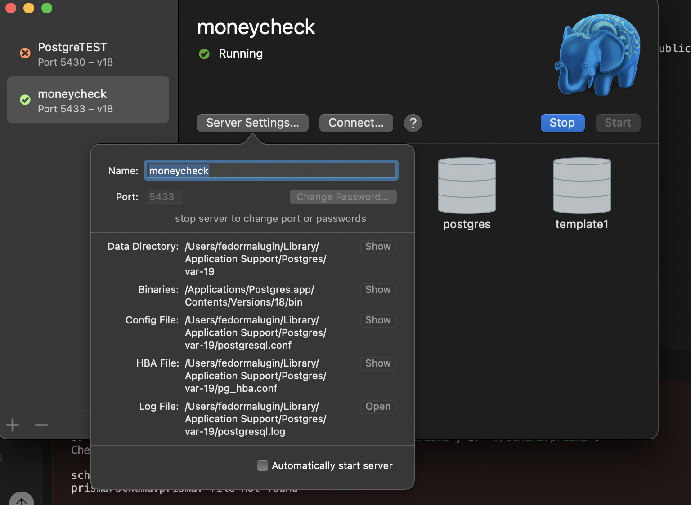

# Finance Tracker MVP

A fullstack personal finance tracker built with React, Express, Prisma, and PostgreSQL.

## Table of Contents

- [What It Does](#what-it-does)
- [Tech Stack](#tech-stack)
- [Screenshots](#screenshots)
- [Project Location](#project-location)
- [Documentation](#documentation)
- [Quick Start](#quick-start)
- [API Docs](#api-docs)

## What It Does

- User registration and login
- JWT-based authentication
- Add, edit, and delete transactions
- Pagination, filters, and sorting
- Balance charts
- CSV export and import
- Swagger API documentation

## Tech Stack

- Frontend: React, Vite, TypeScript, React Router, Recharts
- Backend: Node.js, Express, TypeScript
- Database: PostgreSQL
- ORM: Prisma

## Screenshots

Database setup example:


App screens:




## Project Location

The runnable application lives inside:

```text
Free_Style/finance-tracker-mvp/
  client/
  server/
```

## Documentation

- Local setup guide: [SETUP.md](/Users/fedormalugin/Desktop/Finance_Tracker/SETUP.md)
- Deployment notes: [DEPLOY.md](/Users/fedormalugin/Desktop/Finance_Tracker/DEPLOY.md)
- Server env template: [server/.env.example](/Users/fedormalugin/Desktop/Finance_Tracker/Free_Style/finance-tracker-mvp/server/.env.example)
- Client env template: [client/.env.example](/Users/fedormalugin/Desktop/Finance_Tracker/Free_Style/finance-tracker-mvp/client/.env.example)

## Quick Start

1. Follow [SETUP.md](/Users/fedormalugin/Desktop/Finance_Tracker/SETUP.md)
2. Start the backend on `http://localhost:3001`
3. Start the frontend on `http://localhost:5173` or `http://127.0.0.1:5173`
4. Register a new user and start tracking data

## API Docs

When the backend is running:

```text
http://localhost:3001/api-docs
```
